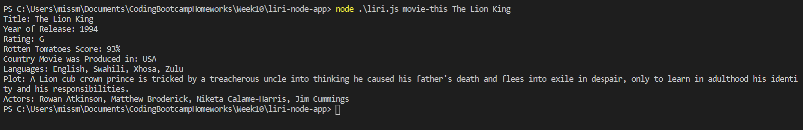
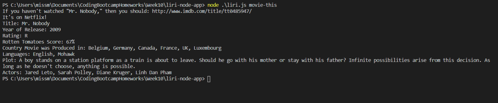
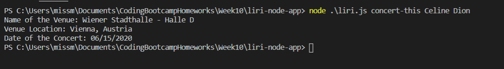
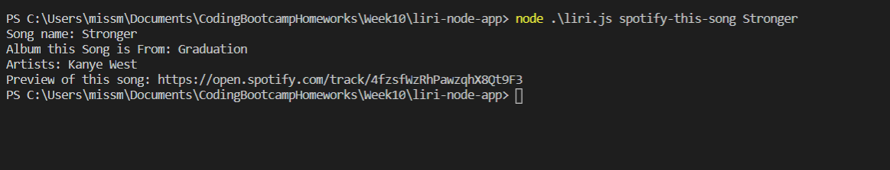
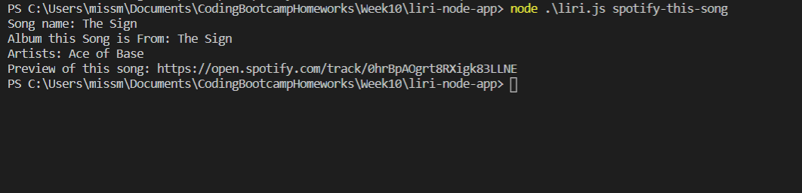
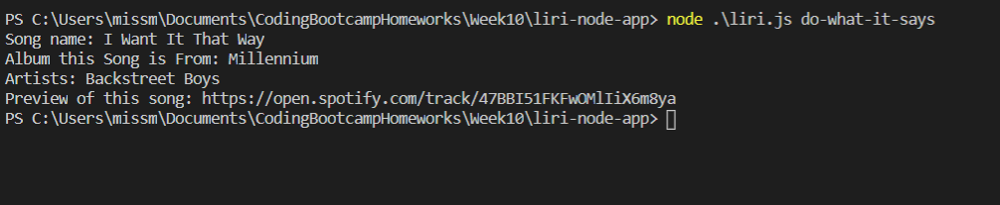

# LIRI_Bot

No HTML file for this project.

# Overview
The LIRI Bot is similar to Apples SIRI in the way that it takes user input and returns information. Though, instead of SIRIs Speech Interpretation and Recognition Interface, LIRI is a Language Interpretation and Recognition Interface. LIRI is a node.js application that takes in particular parameters and returns data on the designated input.

# APIs Used
● Spotify  
● OMDB Movies  
● Bands in Town  

# Nodes Used - Prerequisites
● node-spotifiy-api  
● moment  
● axios  
● fs  

# Installation
First thing that is required is the installation of each of the nodes above. Go into the terminal and type  
<b>'npm init -y'</b>  
into the folder that you would like to run this file in. After this is done, you can type  
<b>'npm install name-of-node-here'</b> or <b>'npm i name-of-node-here'</b>  
for each of the nodes above, excluding fs, to be able to run the javascript file.

# Usage
Navigate to folder that this repository is in and open it in your terminal, inside your terminal window you can type  
<b>'node liri.js command-here search-term-here'</b>  
and hit enter to run the javascript file. 
<b> Commands include: </b>  
1) movie-this  
2) concert-this  
3) spotify-this-song  
4) do-what-it-says   

These commands plus your search term will return data from one of the APIs included in the list above. The fourth command 'do-what-it-says' does not need another input because it will read the information from the random.txt file and put it into the spotify-this-song command for you.

# movie-this
When the movie-this command is run with an movie title being typed in by the user, the title, year of release, rating, rotten tomato score, country of production, languages, plot, and actors of the movie typed in will be shown to the user through the OMDB API.  
  
While, if the same command is run without a movie title being input, the same information will be provided, but for a new movie "Mr. Nobody" with a link to where it can be watched.  

# concert-this
When the concert-this command is run with an artists name, the name of the venue, venue location, and date of the venue will all be displayed for the user to see through the Bands in Town API.  

# spotifiy-this-song
When the spotify-this-song command is run, the song name, album the song if from, artist, and a link to a preview of the song typed in will be displayed to the user through the Spotify API.  
  
When this command is run without a song name put in, the song 'The Sign' will be shown to the user instead.  

# do-what-it-says
When this special command is run, there is no other input required. This is because this command will read the random.txt file in the folder and user that folder as input for the spotify-this-song command.  

